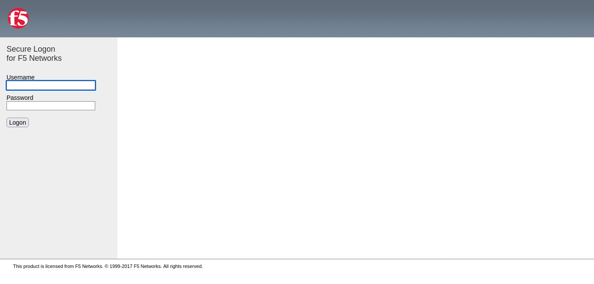
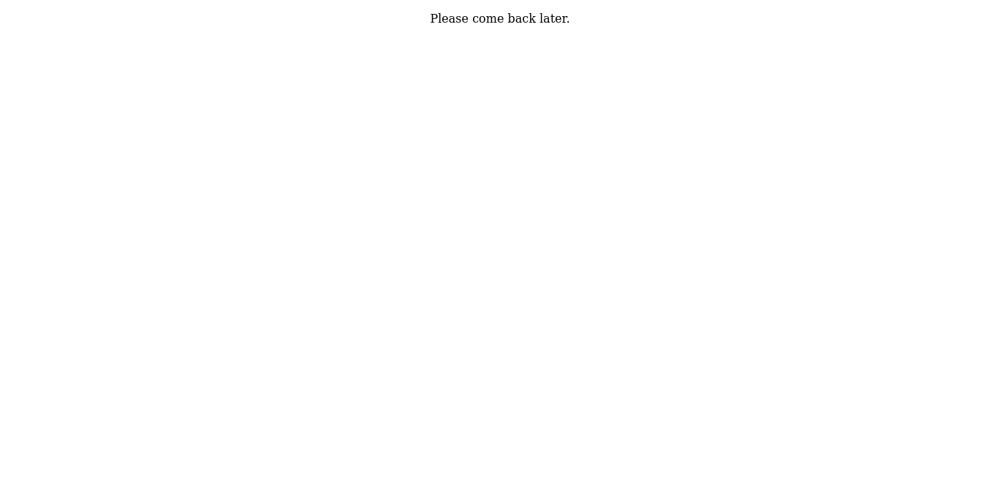
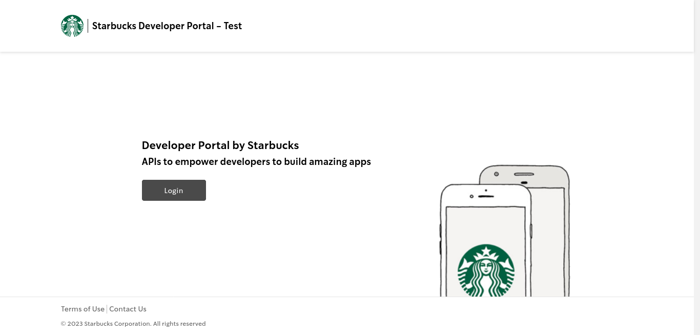
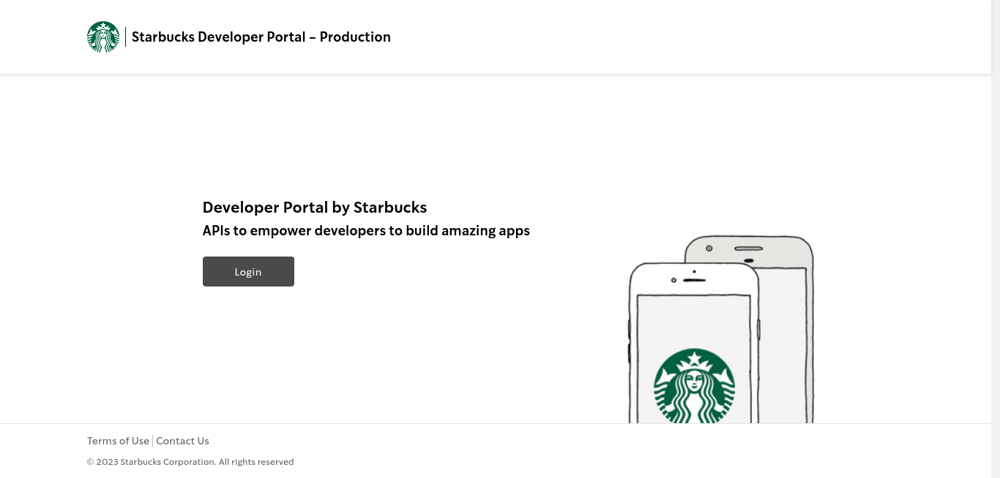
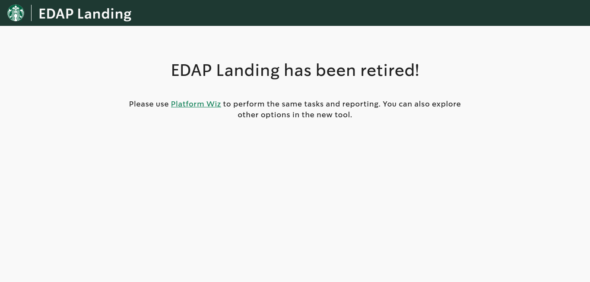
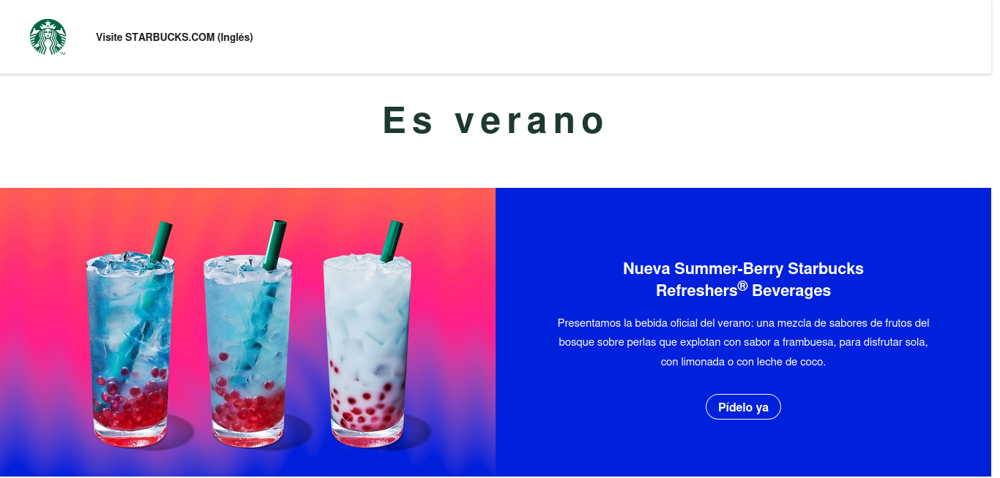
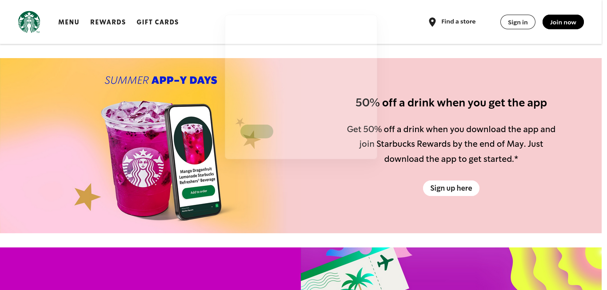
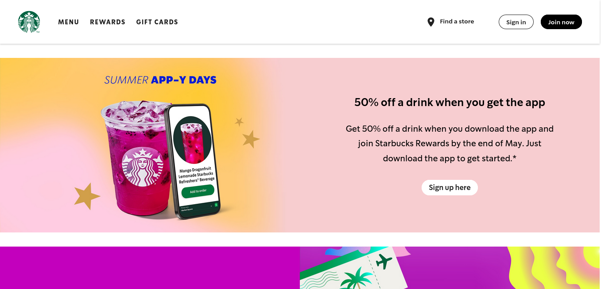

<html>
        <head>
        <title>EyeWitness Report Table of Contents</title>
        </head>
        <h2>Table of Contents</h2><li><a href="report.html#netdev">Network Devices (Page 1)</a></li><li><a href="report.html#uncat">Uncategorized (Page 1)</a></li><li><a href="report_page4.html#crap">Splash Pages (Page 4)</a></li><li><a href="report_page5.html#empty">No Significant Content (Page 5)</a></li><li><a href="report_page5.html#unauth">401/403 Unauthorized (Page 5)</a></li><li><a href="report_page9.html#notfound">404 Not Found (Page 9)</a></li><li><a href="report_page10.html#badreq">Bad Request (Page 10)</a></li><li><a href="report_page10.html#badgw">Bad Gateway (Page 10)</a></li></ul>  <table class="table"><tr><td>Network Devices</td><td>5</td><tr><td>Uncategorized</td><td>92</td><tr><td>Splash Pages</td><td>5</td><tr><td>No Significant Content</td><td>13</td><tr><td>401/403 Unauthorized</td><td>91</td><tr><td>404 Not Found</td><td>38</td><tr><td>Bad Request</td><td>1</td><tr><td>Bad Gateway</td><td>1</td><tr><td>Errors</td><td>999</td></tr><tr><th>Total</th><td>1245</td></tr></table>  
<html>
        <head>
        <link rel="stylesheet" href="https://maxcdn.bootstrapcdn.com/bootstrap/3.3.7/css/bootstrap.min.css" type="text/css"/>
        <title>EyeWitness Report</title>
        
        
        </head>
        <body>
        

        
Report Generated on 2024/05/24 at 00:13:13
<h3>Page 1</h3>
<a href="report_page2.html" id="next"> Next Page </a>

 <a href="report.html"> Page 1</a><a href="report_page2.html"> Page 2</a><a href="report_page3.html"> Page 3</a><a href="report_page4.html"> Page 4</a><a href="report_page5.html"> Page 5</a><a href="report_page6.html"> Page 6</a><a href="report_page7.html"> Page 7</a><a href="report_page8.html"> Page 8</a><a href="report_page9.html"> Page 9</a><a href="report_page10.html"> Page 10</a><a href="report_page11.html"> Page 11</a><a href="report_page12.html"> Page 12</a><a href="report_page13.html"> Page 13</a><a href="report_page14.html"> Page 14</a><a href="report_page15.html"> Page 15</a><a href="report_page16.html"> Page 16</a><a href="report_page17.html"> Page 17</a><a href="report_page18.html"> Page 18</a><a href="report_page19.html"> Page 19</a><a href="report_page20.html"> Page 20</a><a href="report_page21.html"> Page 21</a><a href="report_page22.html"> Page 22</a><a href="report_page23.html"> Page 23</a><a href="report_page24.html"> Page 24</a><a href="report_page25.html"> Page 25</a><a href="report_page26.html"> Page 26</a><a href="report_page27.html"> Page 27</a><a href="report_page28.html"> Page 28</a><a href="report_page29.html"> Page 29</a><a href="report_page30.html"> Page 30</a><a href="report_page31.html"> Page 31</a><a href="report_page32.html"> Page 32</a><a href="report_page33.html"> Page 33</a><a href="report_page34.html"> Page 34</a><a href="report_page35.html"> Page 35</a><a href="report_page36.html"> Page 36</a><a href="report_page37.html"> Page 37</a><a href="report_page38.html"> Page 38</a><a href="report_page39.html"> Page 39</a><a href="report_page40.html"> Page 40</a><a href="report_page41.html"> Page 41</a><a href="report_page42.html"> Page 42</a><a href="report_page43.html"> Page 43</a><a href="report_page44.html"> Page 44</a><a href="report_page45.html"> Page 45</a><a href="report_page46.html"> Page 46</a><a href="report_page47.html"> Page 47</a><a href="report_page48.html"> Page 48</a><a href="report_page49.html"> Page 49</a><a href="report_page50.html"> Page 50</a>

<h2 id="netdev">Network Devices</h2><table border="1">
        <tr>
        <th>Web Request Info</th>
        <th>Web Screenshot</th>
        </tr><tr>
            <td>

            <a href="http://activesync-iad.starbucks.com" target="_blank">http://activesync-iad.starbucks.com</a> 
            <b>Resolved to:</b> 98.99.254.18 
 <b> Page Title: </b>activesync-iad.starbucks.com
 <b> Server:</b> BigIP
 <b> Content-Type:</b> text/html; charset=utf-8
 <b> Accept-Ranges:</b> bytes
 <b> Connection:</b> close
 <b> Date:</b> Fri, 24 May 2024 04:52:32 GMT
 <b> Age:</b> 3140
 <b> Content-Length:</b> 5303
 <b> X-Frame-Options:</b> DENY
 <b> Set-Cookie:</b> MRHSession=deleted;expires=Thu, 01-Jan-1970 00:00:01 GMT;path=/
 <b> Pragma:</b> no-cache
 <b> Cache-Control:</b> no-cache, must-revalidate
 <b> Vary:</b> Accept-Encoding
 <b> Response Code:</b> 200
  <a href="source/http.activesync-iad.starbucks.com.txt"
                target="_blank">Source Code</a>
</td>
                <td>

</td></tr>

        
<tr>
            <td>

            <a href="http://activesync.starbucks.com" target="_blank">http://activesync.starbucks.com</a> 
            <b>Resolved to:</b> 98.99.250.18 
 <b> Page Title: </b>activesync.starbucks.com
 <b> Server:</b> BigIP
 <b> Content-Type:</b> text/html; charset=utf-8
 <b> Accept-Ranges:</b> bytes
 <b> Connection:</b> close
 <b> Date:</b> Fri, 24 May 2024 04:22:23 GMT
 <b> Age:</b> 31539
 <b> Content-Length:</b> 5274
 <b> X-Frame-Options:</b> DENY
 <b> Set-Cookie:</b> MRHSession=deleted;expires=Thu, 01-Jan-1970 00:00:01 GMT;path=/;secure
 <b> Pragma:</b> no-cache
 <b> Cache-Control:</b> no-cache, must-revalidate
 <b> Vary:</b> Accept-Encoding
 <b> Response Code:</b> 200
  <a href="source/http.activesync.starbucks.com.txt"
                target="_blank">Source Code</a>
</td>
                <td>

</td></tr>

        
<tr>
            <td>

            <a href="http://activesync.starbucks.com" target="_blank">http://activesync.starbucks.com</a> 
            <b>Resolved to:</b> 98.99.250.18 
 <b> Page Title: </b>activesync.starbucks.com
 <b> Server:</b> BigIP
 <b> Content-Type:</b> text/html; charset=utf-8
 <b> Accept-Ranges:</b> bytes
 <b> Connection:</b> close
 <b> Date:</b> Fri, 24 May 2024 05:09:49 GMT
 <b> Age:</b> 34385
 <b> Content-Length:</b> 5274
 <b> X-Frame-Options:</b> DENY
 <b> Set-Cookie:</b> MRHSession=deleted;expires=Thu, 01-Jan-1970 00:00:01 GMT;path=/;secure
 <b> Pragma:</b> no-cache
 <b> Cache-Control:</b> no-cache, must-revalidate
 <b> Vary:</b> Accept-Encoding
 <b> Response Code:</b> 200
  <a href="source/http.activesync.starbucks.com.txt"
                target="_blank">Source Code</a>
</td>
                <td>

</td></tr>

        
<tr>
            <td>

            <a href="http://ews-iad2.starbucks.com" target="_blank">http://ews-iad2.starbucks.com</a> 
            <b>Resolved to:</b> 98.99.254.18 
 <b> Page Title: </b>ews-iad2.starbucks.com
 <b> Server:</b> BigIP
 <b> Content-Type:</b> text/html; charset=utf-8
 <b> Accept-Ranges:</b> bytes
 <b> Connection:</b> close
 <b> Date:</b> Fri, 24 May 2024 04:40:28 GMT
 <b> Age:</b> 2416
 <b> Content-Length:</b> 5303
 <b> X-Frame-Options:</b> DENY
 <b> Set-Cookie:</b> MRHSession=deleted;expires=Thu, 01-Jan-1970 00:00:01 GMT;path=/
 <b> Pragma:</b> no-cache
 <b> Cache-Control:</b> no-cache, must-revalidate
 <b> Vary:</b> Accept-Encoding
 <b> Response Code:</b> 200
  <a href="source/http.ews-iad2.starbucks.com.txt"
                target="_blank">Source Code</a>
</td>
                <td>

</td></tr>

        
<tr>
            <td>

            <a href="http://ews.starbucks.com" target="_blank">http://ews.starbucks.com</a> 
            <b>Resolved to:</b> 98.99.254.18 
 <b> Page Title: </b>ews.starbucks.com
 <b> Server:</b> BigIP
 <b> Content-Type:</b> text/html; charset=utf-8
 <b> Accept-Ranges:</b> bytes
 <b> Connection:</b> close
 <b> Date:</b> Fri, 24 May 2024 04:32:24 GMT
 <b> Age:</b> 1932
 <b> Content-Length:</b> 5303
 <b> X-Frame-Options:</b> DENY
 <b> Set-Cookie:</b> MRHSession=deleted;expires=Thu, 01-Jan-1970 00:00:01 GMT;path=/
 <b> Pragma:</b> no-cache
 <b> Cache-Control:</b> no-cache, must-revalidate
 <b> Vary:</b> Accept-Encoding
 <b> Response Code:</b> 200
  <a href="source/http.ews.starbucks.com.txt"
                target="_blank">Source Code</a>
</td>
                <td>

</td></tr>

        
</table> <h2 id="uncat">Uncategorized</h2><table border="1">
        <tr>
        <th>Web Request Info</th>
        <th>Web Screenshot</th>
        </tr><tr>
            <td>

            <a href="http://outlook-iad.starbucks.com" target="_blank">http://outlook-iad.starbucks.com</a> 
            <b>Resolved to:</b> 98.99.254.66 
 <b> Page Title: </b>BIG-IP logout page
 <b> Server:</b> BigIP
 <b> Content-Type:</b> text/html; charset=utf-8
 <b> Accept-Ranges:</b> bytes
 <b> Connection:</b> Keep-Alive
 <b> Date:</b> Fri, 24 May 2024 04:42:44 GMT
 <b> Age:</b> 19708
 <b> Content-Length:</b> 4253
 <b> X-Frame-Options:</b> DENY
 <b> Set-Cookie:</b> MRHSession=deleted;expires=Thu, 01-Jan-1970 00:00:01 GMT;path=/
 <b> Pragma:</b> no-cache
 <b> Cache-Control:</b> no-cache, must-revalidate
 <b> Response Code:</b> 200
  <a href="source/http.outlook-iad.starbucks.com.txt"
                target="_blank">Source Code</a>
</td>
                <td>

</td></tr>

        
<tr>
            <td>

            <a href="http://via.starbucks.com" target="_blank">http://via.starbucks.com</a> 
            <b>Resolved to:</b> 98.129.229.236 
 <b> Page Title: </b>Coming Soon page
 <b> Server:</b> Apache/2.4
 <b> Content-Type:</b> text/html; charset=UTF-8
 <b> Date:</b> Fri, 24 May 2024 05:11:21 GMT
 <b> Accept-Ranges:</b> bytes
 <b> Connection:</b> close
 <b> Set-Cookie:</b> X-Mapping-ahcgogmn=A1BEE1ED3EC209C67925CF0D32DF79E3; path=/
 <b> Last-Modified:</b> Fri, 17 Mar 2023 04:12:36 GMT
 <b> Content-Length:</b> 201
 <b> Response Code:</b> 200
  <a href="source/http.via.starbucks.com.txt"
                target="_blank">Source Code</a>
</td>
                <td>

</td></tr>

        
<tr>
            <td>

            <a href="http://via.starbucks.com" target="_blank">http://via.starbucks.com</a> 
            <b>Resolved to:</b> 98.129.229.236 
 <b> Page Title: </b>Coming Soon page
 <b> Server:</b> Apache/2.4
 <b> Content-Type:</b> text/html; charset=UTF-8
 <b> Date:</b> Fri, 24 May 2024 04:26:38 GMT
 <b> Accept-Ranges:</b> bytes
 <b> Connection:</b> close
 <b> Set-Cookie:</b> X-Mapping-ahcgogmn=A1BEE1ED3EC209C67925CF0D32DF79E3; path=/
 <b> Last-Modified:</b> Fri, 17 Mar 2023 04:12:36 GMT
 <b> Content-Length:</b> 201
 <b> Response Code:</b> 200
  <a href="source/http.via.starbucks.com.txt"
                target="_blank">Source Code</a>
</td>
                <td>

</td></tr>

        
<tr>
            <td>

            <a href="http://test.developer.starbucks.com" target="_blank">http://test.developer.starbucks.com</a> 
            <b>Resolved to:</b> 151.101.2.228 
 <b> Page Title: </b>Home | Starbucks Developer Portal
 <b> Connection:</b> close
 <b> Cache-Control:</b> must-revalidate, no-cache, private
 <b> Content-Language:</b> en
 <b> Content-Type:</b> text/html; charset=UTF-8
 <b> Expires:</b> Sun, 19 Nov 1978 05:00:00 GMT
 <b> Server:</b> nginx
 <b> Strict-Transport-Security:</b> max-age=300
 <b> X-Content-Type-Options:</b> nosniff
 <b> X-Drupal-Cache:</b> HIT
 <b> X-Drupal-Dynamic-Cache:</b> MISS
 <b> X-Frame-Options:</b> SAMEORIGIN
 <b> X-Generator:</b> Drupal 10 (https://www.drupal.org)
 <b> X-Pantheon-Styx-Hostname:</b> styx-fe1-a-788d76885-wg5hd
 <b> X-Styx-Req-Id:</b> 9485f8ab-198d-11ef-931a-96ee94b54e6b
 <b> Age:</b> 0
 <b> Accept-Ranges:</b> bytes
 <b> Via:</b> 1.1 varnish, 1.1 varnish, 1.1 varnish
 <b> Date:</b> Fri, 24 May 2024 05:22:14 GMT
 <b> X-Served-By:</b> cache-chi-kigq8000106-CHI, cache-maa10239-MAA, cache-maa10245-MAA
 <b> X-Cache:</b> MISS, MISS, MISS
 <b> X-Cache-Hits:</b> 0, 0, 0
 <b> X-Timer:</b> S1716528134.329644,VS0,VE279
 <b> Vary:</b> Accept-Encoding, Cookie, Cookie
 <b> transfer-encoding:</b> chunked
 <b> Response Code:</b> 200
  <a href="source/http.test.developer.starbucks.com.txt"
                target="_blank">Source Code</a>
</td>
                <td>

</td></tr>

        
<tr>
            <td>

            <a href="http://developer.starbucks.com" target="_blank">http://developer.starbucks.com</a> 
            <b>Resolved to:</b> 151.101.2.228 
 <b> Page Title: </b>Home | Starbucks Developer Portal - Production
 <b> Connection:</b> close
 <b> Cache-Control:</b> must-revalidate, no-cache, private
 <b> Content-Language:</b> en
 <b> Content-Type:</b> text/html; charset=UTF-8
 <b> Expires:</b> Sun, 19 Nov 1978 05:00:00 GMT
 <b> Server:</b> nginx
 <b> Strict-Transport-Security:</b> max-age=300
 <b> X-Content-Type-Options:</b> nosniff
 <b> X-Drupal-Cache:</b> HIT
 <b> X-Drupal-Dynamic-Cache:</b> MISS
 <b> X-Frame-Options:</b> SAMEORIGIN
 <b> X-Generator:</b> Drupal 10 (https://www.drupal.org)
 <b> X-Pantheon-Styx-Hostname:</b> styx-fe1-a-788d76885-n8bjx
 <b> X-Styx-Req-Id:</b> 06140d96-198d-11ef-a171-76a8f98c32e1
 <b> Age:</b> 0
 <b> Accept-Ranges:</b> bytes
 <b> Via:</b> 1.1 varnish, 1.1 varnish, 1.1 varnish
 <b> Date:</b> Fri, 24 May 2024 05:18:15 GMT
 <b> X-Served-By:</b> cache-chi-klot8100049-CHI, cache-maa10249-MAA, cache-maa10228-MAA
 <b> X-Cache:</b> MISS, MISS, MISS
 <b> X-Cache-Hits:</b> 0, 0, 0
 <b> X-Timer:</b> S1716527895.347915,VS0,VE269
 <b> Vary:</b> Accept-Encoding, Cookie, Cookie
 <b> transfer-encoding:</b> chunked
 <b> Response Code:</b> 200
  <a href="source/http.developer.starbucks.com.txt"
                target="_blank">Source Code</a>
</td>
                <td>

</td></tr>

        
<tr>
            <td>

            <a href="http://developer.starbucks.com" target="_blank">http://developer.starbucks.com</a> 
            <b>Resolved to:</b> 151.101.2.228 
 <b> Page Title: </b>Home | Starbucks Developer Portal - Production
 <b> Connection:</b> close
 <b> Cache-Control:</b> must-revalidate, no-cache, private
 <b> Content-Language:</b> en
 <b> Content-Type:</b> text/html; charset=UTF-8
 <b> Expires:</b> Sun, 19 Nov 1978 05:00:00 GMT
 <b> Server:</b> nginx
 <b> Strict-Transport-Security:</b> max-age=300
 <b> X-Content-Type-Options:</b> nosniff
 <b> X-Drupal-Cache:</b> HIT
 <b> X-Drupal-Dynamic-Cache:</b> HIT
 <b> X-Frame-Options:</b> SAMEORIGIN
 <b> X-Generator:</b> Drupal 10 (https://www.drupal.org)
 <b> X-Pantheon-Styx-Hostname:</b> styx-fe1-a-788d76885-n8bjx
 <b> X-Styx-Req-Id:</b> f85c4509-1984-11ef-a171-76a8f98c32e1
 <b> Age:</b> 0
 <b> Accept-Ranges:</b> bytes
 <b> Via:</b> 1.1 varnish, 1.1 varnish, 1.1 varnish
 <b> Date:</b> Fri, 24 May 2024 04:20:36 GMT
 <b> X-Served-By:</b> cache-chi-klot8100049-CHI, cache-maa10249-MAA, cache-maa10225-MAA
 <b> X-Cache:</b> MISS, MISS, MISS
 <b> X-Cache-Hits:</b> 0, 0, 0
 <b> X-Timer:</b> S1716524436.357318,VS0,VE278
 <b> Vary:</b> Accept-Encoding, Cookie, Cookie
 <b> transfer-encoding:</b> chunked
 <b> Response Code:</b> 200
  <a href="source/http.developer.starbucks.com.txt"
                target="_blank">Source Code</a>
</td>
                <td>

</td></tr>

        
<tr>
            <td>

            <a href="http://uploads.scm.starbucks.com" target="_blank">http://uploads.scm.starbucks.com</a> 
            <b>Resolved to:</b> 98.99.250.203 
 <b> Page Title: </b>Initiating SAML single sign-on
 <b> Date:</b> Fri, 24 May 2024 04:33:05 GMT
 <b> Content-Type:</b> text/html; charset=utf-8
 <b> Vary:</b> X-PJAX, X-PJAX-Container, Turbo-Visit, Turbo-Frame
 <b> Cache-Control:</b> no-store
 <b> ETag:</b> W/&quot;721b16aa79f704db662f510be56fce01&quot;
 <b> Set-Cookie:</b> saml_csrf_token=jYV943q09lE3oOVt6OYNp9TBtHzCOp0fgSluwy1Tne3TXDkFj07zq5M1GtiEDz7HFi-OqrkOgOpGUHtimlByslmv9JADCqJa7amewc-dQUM; path=/; secure; HttpOnly; SameSite=None
 <b> X-Runtime:</b> 0.039249
 <b> X-GitHub-Request-Id:</b> ec19447c-f0bf-41da-8a4e-1b9ca74af28c
 <b> Strict-Transport-Security:</b> max-age=31536000; includeSubdomains
 <b> X-Frame-Options:</b> deny
 <b> X-Content-Type-Options:</b> nosniff
 <b> X-XSS-Protection:</b> 0
 <b> Referrer-Policy:</b> same-origin
 <b> Content-Security-Policy:</b> default-src &#x27;none&#x27;; base-uri &#x27;self&#x27;; child-src scm.starbucks.com/assets-cdn/worker/ gist.scm.starbucks.com/assets-cdn/worker/; connect-src &#x27;self&#x27; uploads.scm.starbucks.com media.scm.starbucks.com www.githubstatus.com raw.scm.starbucks.com api.githubcopilot.com scm.starbucks.com objects-origin.githubusercontent.com *.actions.githubusercontent.com productionresultssa0.blob.core.windows.net/ productionresultssa1.blob.core.windows.net/ productionresultssa2.blob.core.windows.net/ productionresultssa3.blob.core.windows.net/ productionresultssa4.blob.core.windows.net/ productionresultssa5.blob.core.windows.net/ productionresultssa6.blob.core.windows.net/ productionresultssa7.blob.core.windows.net/ productionresultssa8.blob.core.windows.net/ productionresultssa9.blob.core.windows.net/ wss://*.actions.githubusercontent.com github-production-repository-image-32fea6.s3.amazonaws.com github-production-release-asset-2e65be.s3.amazonaws.com insights.github.com wss://scm.starbucks.com; font-src assets.scm.starbucks.com; form-action &#x27;self&#x27; scm.starbucks.com gist.scm.starbucks.com objects-origin.githubusercontent.com pages.scm.starbucks.com; frame-ancestors &#x27;none&#x27;; frame-src viewscreen.scm.starbucks.com notebooks.scm.starbucks.com support.github.com; img-src * data:; manifest-src &#x27;self&#x27;; media-src media.scm.starbucks.com; script-src assets.scm.starbucks.com; style-src &#x27;unsafe-inline&#x27; assets.scm.starbucks.com; upgrade-insecure-requests; worker-src scm.starbucks.com/assets-cdn/worker/ gist.scm.starbucks.com/assets-cdn/worker/
 <b> connection:</b> close
 <b> Transfer-Encoding:</b> chunked
 <b> Response Code:</b> 200
  <a href="source/http.uploads.scm.starbucks.com.txt"
                target="_blank">Source Code</a>
</td>
                <td>

</td></tr>

        
<tr>
            <td>

            <a href="http://media.scm.starbucks.com" target="_blank">http://media.scm.starbucks.com</a> 
            <b>Resolved to:</b> 98.99.250.203 
 <b> Page Title: </b>Initiating SAML single sign-on
 <b> Date:</b> Fri, 24 May 2024 04:47:02 GMT
 <b> Content-Type:</b> text/html; charset=utf-8
 <b> Vary:</b> X-PJAX, X-PJAX-Container, Turbo-Visit, Turbo-Frame
 <b> Cache-Control:</b> no-store
 <b> ETag:</b> W/&quot;8758fd96ce11270ad99ced76e5fa13db&quot;
 <b> Set-Cookie:</b> saml_csrf_token=uRS2KbzabgcXgKX45Le5TDdFQIUTKwfdRTsAoBDvHvbF7-FX_C59iVDhYmX4stCWp3XkLHrABCGg9qL6LPYMHPrG-WYkoB7WkbDdtbdoUSE; path=/; secure; HttpOnly; SameSite=None
 <b> X-Runtime:</b> 0.036429
 <b> X-GitHub-Request-Id:</b> 0bb95d73-cccb-4890-90c8-5825762ecb91
 <b> Strict-Transport-Security:</b> max-age=31536000; includeSubdomains
 <b> X-Frame-Options:</b> deny
 <b> X-Content-Type-Options:</b> nosniff
 <b> X-XSS-Protection:</b> 0
 <b> Referrer-Policy:</b> same-origin
 <b> Content-Security-Policy:</b> default-src &#x27;none&#x27;; base-uri &#x27;self&#x27;; child-src scm.starbucks.com/assets-cdn/worker/ gist.scm.starbucks.com/assets-cdn/worker/; connect-src &#x27;self&#x27; uploads.scm.starbucks.com media.scm.starbucks.com www.githubstatus.com raw.scm.starbucks.com api.githubcopilot.com scm.starbucks.com objects-origin.githubusercontent.com *.actions.githubusercontent.com productionresultssa0.blob.core.windows.net/ productionresultssa1.blob.core.windows.net/ productionresultssa2.blob.core.windows.net/ productionresultssa3.blob.core.windows.net/ productionresultssa4.blob.core.windows.net/ productionresultssa5.blob.core.windows.net/ productionresultssa6.blob.core.windows.net/ productionresultssa7.blob.core.windows.net/ productionresultssa8.blob.core.windows.net/ productionresultssa9.blob.core.windows.net/ wss://*.actions.githubusercontent.com github-production-repository-image-32fea6.s3.amazonaws.com github-production-release-asset-2e65be.s3.amazonaws.com insights.github.com wss://scm.starbucks.com; font-src assets.scm.starbucks.com; form-action &#x27;self&#x27; scm.starbucks.com gist.scm.starbucks.com objects-origin.githubusercontent.com pages.scm.starbucks.com; frame-ancestors &#x27;none&#x27;; frame-src viewscreen.scm.starbucks.com notebooks.scm.starbucks.com support.github.com; img-src * data:; manifest-src &#x27;self&#x27;; media-src media.scm.starbucks.com; script-src assets.scm.starbucks.com; style-src &#x27;unsafe-inline&#x27; assets.scm.starbucks.com; upgrade-insecure-requests; worker-src scm.starbucks.com/assets-cdn/worker/ gist.scm.starbucks.com/assets-cdn/worker/
 <b> connection:</b> close
 <b> Transfer-Encoding:</b> chunked
 <b> Response Code:</b> 200
  <a href="source/http.media.scm.starbucks.com.txt"
                target="_blank">Source Code</a>
</td>
                <td>

</td></tr>

        
<tr>
            <td>

            <a href="http://avatars.scm.starbucks.com" target="_blank">http://avatars.scm.starbucks.com</a> 
            <b>Resolved to:</b> 98.99.250.203 
 <b> Page Title: </b>Initiating SAML single sign-on
 <b> Date:</b> Fri, 24 May 2024 04:50:42 GMT
 <b> Content-Type:</b> text/html; charset=utf-8
 <b> Vary:</b> X-PJAX, X-PJAX-Container, Turbo-Visit, Turbo-Frame
 <b> Cache-Control:</b> no-store
 <b> ETag:</b> W/&quot;2e6e030d154cc0c546fb4741aae57b55&quot;
 <b> Set-Cookie:</b> saml_csrf_token=PhmO0pk2EloJXbT5SwA0a4xcWZb6U_J7odWrRZuK18uDf-KszH_3jW-ys5O6XzdfOmfy-rafm8ZNW5G89VIsTgGw8ix8uWddVVt2ySJiPRc; path=/; secure; HttpOnly; SameSite=None
 <b> X-Runtime:</b> 0.049304
 <b> X-GitHub-Request-Id:</b> 312f161d-477a-44d7-a343-75ea96789810
 <b> Strict-Transport-Security:</b> max-age=31536000; includeSubdomains
 <b> X-Frame-Options:</b> deny
 <b> X-Content-Type-Options:</b> nosniff
 <b> X-XSS-Protection:</b> 0
 <b> Referrer-Policy:</b> same-origin
 <b> Content-Security-Policy:</b> default-src &#x27;none&#x27;; base-uri &#x27;self&#x27;; child-src scm.starbucks.com/assets-cdn/worker/ gist.scm.starbucks.com/assets-cdn/worker/; connect-src &#x27;self&#x27; uploads.scm.starbucks.com media.scm.starbucks.com www.githubstatus.com raw.scm.starbucks.com api.githubcopilot.com scm.starbucks.com objects-origin.githubusercontent.com *.actions.githubusercontent.com productionresultssa0.blob.core.windows.net/ productionresultssa1.blob.core.windows.net/ productionresultssa2.blob.core.windows.net/ productionresultssa3.blob.core.windows.net/ productionresultssa4.blob.core.windows.net/ productionresultssa5.blob.core.windows.net/ productionresultssa6.blob.core.windows.net/ productionresultssa7.blob.core.windows.net/ productionresultssa8.blob.core.windows.net/ productionresultssa9.blob.core.windows.net/ wss://*.actions.githubusercontent.com github-production-repository-image-32fea6.s3.amazonaws.com github-production-release-asset-2e65be.s3.amazonaws.com insights.github.com wss://scm.starbucks.com; font-src assets.scm.starbucks.com; form-action &#x27;self&#x27; scm.starbucks.com gist.scm.starbucks.com objects-origin.githubusercontent.com pages.scm.starbucks.com; frame-ancestors &#x27;none&#x27;; frame-src viewscreen.scm.starbucks.com notebooks.scm.starbucks.com support.github.com; img-src * data:; manifest-src &#x27;self&#x27;; media-src media.scm.starbucks.com; script-src assets.scm.starbucks.com; style-src &#x27;unsafe-inline&#x27; assets.scm.starbucks.com; upgrade-insecure-requests; worker-src scm.starbucks.com/assets-cdn/worker/ gist.scm.starbucks.com/assets-cdn/worker/
 <b> connection:</b> close
 <b> Transfer-Encoding:</b> chunked
 <b> Response Code:</b> 200
  <a href="source/http.avatars.scm.starbucks.com.txt"
                target="_blank">Source Code</a>
</td>
                <td>

</td></tr>

        
<tr>
            <td>

            <a href="http://scm.starbucks.com" target="_blank">http://scm.starbucks.com</a> 
            <b>Resolved to:</b> 98.99.250.203 
 <b> Page Title: </b>Initiating SAML single sign-on
 <b> Date:</b> Fri, 24 May 2024 05:09:25 GMT
 <b> Content-Type:</b> text/html; charset=utf-8
 <b> Vary:</b> X-PJAX, X-PJAX-Container, Turbo-Visit, Turbo-Frame
 <b> Cache-Control:</b> no-store
 <b> ETag:</b> W/&quot;69abd57e5a687ebcccf59a8b1e70c4cb&quot;
 <b> Set-Cookie:</b> saml_csrf_token=hQlc7CodjEwOqpxqpLoVYjmg1pOQb8CWQf-g6LyhLzQlK-7BPQiLRgzsL7NVmkRE6vwhBVwEMtK6ifA_H7pbdfOpr86GPQpcTBW-2JjSoUU; path=/; secure; HttpOnly; SameSite=None
 <b> X-Runtime:</b> 0.034761
 <b> X-GitHub-Request-Id:</b> 84472782-81b3-449a-a4f0-699f47478ea0
 <b> Strict-Transport-Security:</b> max-age=31536000; includeSubdomains
 <b> X-Frame-Options:</b> deny
 <b> X-Content-Type-Options:</b> nosniff
 <b> X-XSS-Protection:</b> 0
 <b> Referrer-Policy:</b> same-origin
 <b> Content-Security-Policy:</b> default-src &#x27;none&#x27;; base-uri &#x27;self&#x27;; child-src scm.starbucks.com/assets-cdn/worker/ gist.scm.starbucks.com/assets-cdn/worker/; connect-src &#x27;self&#x27; uploads.scm.starbucks.com media.scm.starbucks.com www.githubstatus.com raw.scm.starbucks.com api.githubcopilot.com scm.starbucks.com objects-origin.githubusercontent.com *.actions.githubusercontent.com productionresultssa0.blob.core.windows.net/ productionresultssa1.blob.core.windows.net/ productionresultssa2.blob.core.windows.net/ productionresultssa3.blob.core.windows.net/ productionresultssa4.blob.core.windows.net/ productionresultssa5.blob.core.windows.net/ productionresultssa6.blob.core.windows.net/ productionresultssa7.blob.core.windows.net/ productionresultssa8.blob.core.windows.net/ productionresultssa9.blob.core.windows.net/ wss://*.actions.githubusercontent.com github-production-repository-image-32fea6.s3.amazonaws.com github-production-release-asset-2e65be.s3.amazonaws.com insights.github.com wss://scm.starbucks.com; font-src assets.scm.starbucks.com; form-action &#x27;self&#x27; scm.starbucks.com gist.scm.starbucks.com objects-origin.githubusercontent.com pages.scm.starbucks.com; frame-ancestors &#x27;none&#x27;; frame-src viewscreen.scm.starbucks.com notebooks.scm.starbucks.com support.github.com; img-src * data:; manifest-src &#x27;self&#x27;; media-src media.scm.starbucks.com; script-src assets.scm.starbucks.com; style-src &#x27;unsafe-inline&#x27; assets.scm.starbucks.com; upgrade-insecure-requests; worker-src scm.starbucks.com/assets-cdn/worker/ gist.scm.starbucks.com/assets-cdn/worker/
 <b> connection:</b> close
 <b> Transfer-Encoding:</b> chunked
 <b> Response Code:</b> 200
  <a href="source/http.scm.starbucks.com.txt"
                target="_blank">Source Code</a>
</td>
                <td>

</td></tr>

        
<tr>
            <td>

            <a href="http://assets.scm.starbucks.com" target="_blank">http://assets.scm.starbucks.com</a> 
            <b>Resolved to:</b> 98.99.250.203 
 <b> Page Title: </b>Initiating SAML single sign-on
 <b> Date:</b> Fri, 24 May 2024 05:19:33 GMT
 <b> Content-Type:</b> text/html; charset=utf-8
 <b> Vary:</b> X-PJAX, X-PJAX-Container, Turbo-Visit, Turbo-Frame
 <b> Cache-Control:</b> no-store
 <b> ETag:</b> W/&quot;44dddc221d6c657d86a311b8966c713d&quot;
 <b> Set-Cookie:</b> saml_csrf_token=AJ-eA4b4WqQLuhXzbERGW_7qr0NqzxkHPP7as_2urKtWF5VTx-HgVc-UAuHZ_bgAEwtOSThbdzxJviD9QgaJ-hw-9XcJG69gQ28bVUWUD5E; path=/; secure; HttpOnly; SameSite=None
 <b> X-Runtime:</b> 0.039844
 <b> X-GitHub-Request-Id:</b> 09644fed-d07a-414e-899d-82c38ed0f759
 <b> Strict-Transport-Security:</b> max-age=31536000; includeSubdomains
 <b> X-Frame-Options:</b> deny
 <b> X-Content-Type-Options:</b> nosniff
 <b> X-XSS-Protection:</b> 0
 <b> Referrer-Policy:</b> same-origin
 <b> Content-Security-Policy:</b> default-src &#x27;none&#x27;; base-uri &#x27;self&#x27;; child-src scm.starbucks.com/assets-cdn/worker/ gist.scm.starbucks.com/assets-cdn/worker/; connect-src &#x27;self&#x27; uploads.scm.starbucks.com media.scm.starbucks.com www.githubstatus.com raw.scm.starbucks.com api.githubcopilot.com scm.starbucks.com objects-origin.githubusercontent.com *.actions.githubusercontent.com productionresultssa0.blob.core.windows.net/ productionresultssa1.blob.core.windows.net/ productionresultssa2.blob.core.windows.net/ productionresultssa3.blob.core.windows.net/ productionresultssa4.blob.core.windows.net/ productionresultssa5.blob.core.windows.net/ productionresultssa6.blob.core.windows.net/ productionresultssa7.blob.core.windows.net/ productionresultssa8.blob.core.windows.net/ productionresultssa9.blob.core.windows.net/ wss://*.actions.githubusercontent.com github-production-repository-image-32fea6.s3.amazonaws.com github-production-release-asset-2e65be.s3.amazonaws.com insights.github.com wss://scm.starbucks.com; font-src assets.scm.starbucks.com; form-action &#x27;self&#x27; scm.starbucks.com gist.scm.starbucks.com objects-origin.githubusercontent.com pages.scm.starbucks.com; frame-ancestors &#x27;none&#x27;; frame-src viewscreen.scm.starbucks.com notebooks.scm.starbucks.com support.github.com; img-src * data:; manifest-src &#x27;self&#x27;; media-src media.scm.starbucks.com; script-src assets.scm.starbucks.com; style-src &#x27;unsafe-inline&#x27; assets.scm.starbucks.com; upgrade-insecure-requests; worker-src scm.starbucks.com/assets-cdn/worker/ gist.scm.starbucks.com/assets-cdn/worker/
 <b> connection:</b> close
 <b> Transfer-Encoding:</b> chunked
 <b> Response Code:</b> 200
  <a href="source/http.assets.scm.starbucks.com.txt"
                target="_blank">Source Code</a>
</td>
                <td>

</td></tr>

        
<tr>
            <td>

            <a href="http://gist.scm.starbucks.com" target="_blank">http://gist.scm.starbucks.com</a> 
            <b>Resolved to:</b> 98.99.250.203 
 <b> Page Title: </b>Initiating SAML single sign-on
 <b> Date:</b> Fri, 24 May 2024 05:27:23 GMT
 <b> Content-Type:</b> text/html; charset=utf-8
 <b> Vary:</b> X-PJAX, X-PJAX-Container, Turbo-Visit, Turbo-Frame
 <b> Cache-Control:</b> no-store
 <b> ETag:</b> W/&quot;f6030efda5d4b2785a492f2854aafc37&quot;
 <b> Set-Cookie:</b> saml_csrf_token=X6sLv5AwQYLemQgcvRchO2ayJjlZpc4qvoTnxZ9jYS9hn4afFNabvYfVNxbD6KPZv7fF9QRRUuXU08NoNnOdc1EPy-ItuiahXt2pzWKKOaw; path=/; secure; HttpOnly; SameSite=None
 <b> X-Runtime:</b> 0.033401
 <b> X-GitHub-Request-Id:</b> ea20efef-de93-47fc-930a-a7763bd3d16b
 <b> Strict-Transport-Security:</b> max-age=31536000; includeSubdomains
 <b> X-Frame-Options:</b> deny
 <b> X-Content-Type-Options:</b> nosniff
 <b> X-XSS-Protection:</b> 0
 <b> Referrer-Policy:</b> same-origin
 <b> Content-Security-Policy:</b> default-src &#x27;none&#x27;; base-uri &#x27;self&#x27;; child-src scm.starbucks.com/assets-cdn/worker/ gist.scm.starbucks.com/assets-cdn/worker/; connect-src &#x27;self&#x27; uploads.scm.starbucks.com media.scm.starbucks.com www.githubstatus.com raw.scm.starbucks.com api.githubcopilot.com scm.starbucks.com objects-origin.githubusercontent.com *.actions.githubusercontent.com productionresultssa0.blob.core.windows.net/ productionresultssa1.blob.core.windows.net/ productionresultssa2.blob.core.windows.net/ productionresultssa3.blob.core.windows.net/ productionresultssa4.blob.core.windows.net/ productionresultssa5.blob.core.windows.net/ productionresultssa6.blob.core.windows.net/ productionresultssa7.blob.core.windows.net/ productionresultssa8.blob.core.windows.net/ productionresultssa9.blob.core.windows.net/ wss://*.actions.githubusercontent.com github-production-repository-image-32fea6.s3.amazonaws.com github-production-release-asset-2e65be.s3.amazonaws.com insights.github.com wss://scm.starbucks.com; font-src assets.scm.starbucks.com; form-action &#x27;self&#x27; scm.starbucks.com gist.scm.starbucks.com objects-origin.githubusercontent.com pages.scm.starbucks.com; frame-ancestors &#x27;none&#x27;; frame-src viewscreen.scm.starbucks.com notebooks.scm.starbucks.com support.github.com; img-src * data:; manifest-src &#x27;self&#x27;; media-src media.scm.starbucks.com; script-src assets.scm.starbucks.com; style-src &#x27;unsafe-inline&#x27; assets.scm.starbucks.com; upgrade-insecure-requests; worker-src scm.starbucks.com/assets-cdn/worker/ gist.scm.starbucks.com/assets-cdn/worker/
 <b> connection:</b> close
 <b> Transfer-Encoding:</b> chunked
 <b> Response Code:</b> 200
  <a href="source/http.gist.scm.starbucks.com.txt"
                target="_blank">Source Code</a>
</td>
                <td>

</td></tr>

        
<tr>
            <td>

            <a href="http://reply.scm.starbucks.com" target="_blank">http://reply.scm.starbucks.com</a> 
            <b>Resolved to:</b> 98.99.250.203 
 <b> Page Title: </b>Initiating SAML single sign-on
 <b> Date:</b> Fri, 24 May 2024 05:35:43 GMT
 <b> Content-Type:</b> text/html; charset=utf-8
 <b> Vary:</b> X-PJAX, X-PJAX-Container, Turbo-Visit, Turbo-Frame
 <b> Cache-Control:</b> no-store
 <b> ETag:</b> W/&quot;289068943d4dc8b8978742c746eb7cce&quot;
 <b> Set-Cookie:</b> saml_csrf_token=5cI1Kryt6RZK-Y3CM6M0Jb3y7nDx_3-QI8IKs-2rF1nMmsXNSYT9INOVVWy1upA-H0homxeicURMo7R_f95-x2zF6qOadZJDv7EvJZ2zNGY; path=/; secure; HttpOnly; SameSite=None
 <b> X-Runtime:</b> 0.031770
 <b> X-GitHub-Request-Id:</b> 0438d651-8e93-4b53-9f62-50010d033176
 <b> Strict-Transport-Security:</b> max-age=31536000; includeSubdomains
 <b> X-Frame-Options:</b> deny
 <b> X-Content-Type-Options:</b> nosniff
 <b> X-XSS-Protection:</b> 0
 <b> Referrer-Policy:</b> same-origin
 <b> Content-Security-Policy:</b> default-src &#x27;none&#x27;; base-uri &#x27;self&#x27;; child-src scm.starbucks.com/assets-cdn/worker/ gist.scm.starbucks.com/assets-cdn/worker/; connect-src &#x27;self&#x27; uploads.scm.starbucks.com media.scm.starbucks.com www.githubstatus.com raw.scm.starbucks.com api.githubcopilot.com scm.starbucks.com objects-origin.githubusercontent.com *.actions.githubusercontent.com productionresultssa0.blob.core.windows.net/ productionresultssa1.blob.core.windows.net/ productionresultssa2.blob.core.windows.net/ productionresultssa3.blob.core.windows.net/ productionresultssa4.blob.core.windows.net/ productionresultssa5.blob.core.windows.net/ productionresultssa6.blob.core.windows.net/ productionresultssa7.blob.core.windows.net/ productionresultssa8.blob.core.windows.net/ productionresultssa9.blob.core.windows.net/ wss://*.actions.githubusercontent.com github-production-repository-image-32fea6.s3.amazonaws.com github-production-release-asset-2e65be.s3.amazonaws.com insights.github.com wss://scm.starbucks.com; font-src assets.scm.starbucks.com; form-action &#x27;self&#x27; scm.starbucks.com gist.scm.starbucks.com objects-origin.githubusercontent.com pages.scm.starbucks.com; frame-ancestors &#x27;none&#x27;; frame-src viewscreen.scm.starbucks.com notebooks.scm.starbucks.com support.github.com; img-src * data:; manifest-src &#x27;self&#x27;; media-src media.scm.starbucks.com; script-src assets.scm.starbucks.com; style-src &#x27;unsafe-inline&#x27; assets.scm.starbucks.com; upgrade-insecure-requests; worker-src scm.starbucks.com/assets-cdn/worker/ gist.scm.starbucks.com/assets-cdn/worker/
 <b> connection:</b> close
 <b> Transfer-Encoding:</b> chunked
 <b> Response Code:</b> 200
  <a href="source/http.reply.scm.starbucks.com.txt"
                target="_blank">Source Code</a>
</td>
                <td>

</td></tr>

        
<tr>
            <td>

            <a href="http://scm.starbucks.com" target="_blank">http://scm.starbucks.com</a> 
            <b>Resolved to:</b> 98.99.250.203 
 <b> Page Title: </b>Initiating SAML single sign-on
 <b> Date:</b> Fri, 24 May 2024 04:27:04 GMT
 <b> Content-Type:</b> text/html; charset=utf-8
 <b> Vary:</b> X-PJAX, X-PJAX-Container, Turbo-Visit, Turbo-Frame
 <b> Cache-Control:</b> no-store
 <b> ETag:</b> W/&quot;17825ca3ba787260771789e58bbac06f&quot;
 <b> Set-Cookie:</b> saml_csrf_token=EOdLPO-VEpRQQOvS0VgTzNQsDUuNe23Gx0t2jQGDbuUJWInwHTvM56LKk-YxluQzreDQ5aBIisGhEJtWdyAd0tOMmjaewrLUu-vtf2J5xB8; path=/; secure; HttpOnly; SameSite=None
 <b> X-Runtime:</b> 0.034107
 <b> X-GitHub-Request-Id:</b> a4ea819e-d0cb-46dd-9125-f2f9011f3531
 <b> Strict-Transport-Security:</b> max-age=31536000; includeSubdomains
 <b> X-Frame-Options:</b> deny
 <b> X-Content-Type-Options:</b> nosniff
 <b> X-XSS-Protection:</b> 0
 <b> Referrer-Policy:</b> same-origin
 <b> Content-Security-Policy:</b> default-src &#x27;none&#x27;; base-uri &#x27;self&#x27;; child-src scm.starbucks.com/assets-cdn/worker/ gist.scm.starbucks.com/assets-cdn/worker/; connect-src &#x27;self&#x27; uploads.scm.starbucks.com media.scm.starbucks.com www.githubstatus.com raw.scm.starbucks.com api.githubcopilot.com scm.starbucks.com objects-origin.githubusercontent.com *.actions.githubusercontent.com productionresultssa0.blob.core.windows.net/ productionresultssa1.blob.core.windows.net/ productionresultssa2.blob.core.windows.net/ productionresultssa3.blob.core.windows.net/ productionresultssa4.blob.core.windows.net/ productionresultssa5.blob.core.windows.net/ productionresultssa6.blob.core.windows.net/ productionresultssa7.blob.core.windows.net/ productionresultssa8.blob.core.windows.net/ productionresultssa9.blob.core.windows.net/ wss://*.actions.githubusercontent.com github-production-repository-image-32fea6.s3.amazonaws.com github-production-release-asset-2e65be.s3.amazonaws.com insights.github.com wss://scm.starbucks.com; font-src assets.scm.starbucks.com; form-action &#x27;self&#x27; scm.starbucks.com gist.scm.starbucks.com objects-origin.githubusercontent.com pages.scm.starbucks.com; frame-ancestors &#x27;none&#x27;; frame-src viewscreen.scm.starbucks.com notebooks.scm.starbucks.com support.github.com; img-src * data:; manifest-src &#x27;self&#x27;; media-src media.scm.starbucks.com; script-src assets.scm.starbucks.com; style-src &#x27;unsafe-inline&#x27; assets.scm.starbucks.com; upgrade-insecure-requests; worker-src scm.starbucks.com/assets-cdn/worker/ gist.scm.starbucks.com/assets-cdn/worker/
 <b> connection:</b> close
 <b> Transfer-Encoding:</b> chunked
 <b> Response Code:</b> 200
  <a href="source/http.scm.starbucks.com.txt"
                target="_blank">Source Code</a>
</td>
                <td>

</td></tr>

        
<tr>
            <td>

            <a href="http://edap.starbucks.com" target="_blank">http://edap.starbucks.com</a> 
            <b>Resolved to:</b> 52.158.222.27 
 <b> Page Title: </b>Maintenance
 <b> Server:</b> Microsoft-Azure-Application-Gateway/v2
 <b> Date:</b> Fri, 24 May 2024 04:49:21 GMT
 <b> Content-Type:</b> text/html
 <b> Content-Length:</b> 191740
 <b> Connection:</b> close
 <b> ETag:</b> &quot;664f85a6-2ecfc&quot;
 <b> Response Code:</b> 502
  <a href="source/http.edap.starbucks.com.txt"
                target="_blank">Source Code</a>
</td>
                <td>

</td></tr>

        
<tr>
            <td>

            <a href="http://edap-nonprod.starbucks.com" target="_blank">http://edap-nonprod.starbucks.com</a> 
            <b>Resolved to:</b> 52.154.250.229 
 <b> Page Title: </b>Maintenance
 <b> Server:</b> Microsoft-Azure-Application-Gateway/v2
 <b> Date:</b> Fri, 24 May 2024 05:30:21 GMT
 <b> Content-Type:</b> text/html
 <b> Content-Length:</b> 191740
 <b> Connection:</b> close
 <b> ETag:</b> &quot;664714ce-2ecfc&quot;
 <b> Response Code:</b> 502
  <a href="source/http.edap-nonprod.starbucks.com.txt"
                target="_blank">Source Code</a>
</td>
                <td>

</td></tr>

        
<tr>
            <td>

            <a href="http://edap-preprod.starbucks.com" target="_blank">http://edap-preprod.starbucks.com</a> 
            <b>Resolved to:</b> 13.86.2.49 
 <b> Page Title: </b>Maintenance
 <b> Server:</b> Microsoft-Azure-Application-Gateway/v2
 <b> Date:</b> Fri, 24 May 2024 04:43:06 GMT
 <b> Content-Type:</b> text/html
 <b> Content-Length:</b> 191748
 <b> Connection:</b> close
 <b> ETag:</b> &quot;664f8568-2ed04&quot;
 <b> Response Code:</b> 502
  <a href="source/http.edap-preprod.starbucks.com.txt"
                target="_blank">Source Code</a>
</td>
                <td>

</td></tr>

        
<tr>
            <td>

            <a href="http://es.starbucks.com" target="_blank">http://es.starbucks.com</a> 
            <b>Resolved to:</b> 66.241.125.53 
 <b> Page Title: </b>Menú destacado: Starbucks Coffee Company
 <b> accept-ranges:</b> bytes
 <b> content-length:</b> 44312
 <b> content-type:</b> text/html; charset=utf-8
 <b> last-modified:</b> Mon, 29 Apr 2024 19:56:14 GMT
 <b> date:</b> Fri, 24 May 2024 04:23:12 GMT
 <b> server:</b> Fly/ff37a3cc6 (2024-05-21)
 <b> via:</b> 1.1 fly.io
 <b> fly-request-id:</b> 01HYMDDBAWH4HVZCWWA483NW3S-bom
 <b> cache-control:</b> max-age=1800, must-revalidate
 <b> Response Code:</b> 200
  <a href="source/http.es.starbucks.com.txt"
                target="_blank">Source Code</a>
</td>
                <td>

</td></tr>

        
<tr>
            <td>

            <a href="http://mobile.starbucks.com" target="_blank">http://mobile.starbucks.com</a> 
            <b>Resolved to:</b> 204.74.99.103 
 <b> Page Title: </b>Starbucks Coffee Company
 <b> Content-Type:</b> text/html; charset=utf-8
 <b> Cache-Control:</b> s-maxage=600, stale-while-revalidate
 <b> ETag:</b> &quot;m4fhbvf8ok2bxh&quot;
 <b> Content-Security-Policy:</b> default-src &#x27;self&#x27; *.starbucks.com *.starbucks.ca; child-src &#x27;self&#x27; *.starbucks.com *.starbucks.ca *.doubleclick.net *.optimizely.com *.trustarc.com; connect-src &#x27;self&#x27; *.starbucks.com *.starbucks.ca https://fonts.gstatic.com *.akamaihd.net *.akstat.io *.doubleclick.net *.go-mpulse.net *.google-analytics.com *.googlevideo.com *.mparticle.com *.nr-data.net *.optimizely.com *.pinterest.com *.trustarc.com; font-src &#x27;self&#x27; *.starbucks.com *.starbucks.ca https://fonts.googleapis.com https://fonts.gstatic.com *.trustarc.com; img-src &#x27;self&#x27; data: *.starbucks.com *.starbucks.ca https://*.gstatic.com *.adsrvr.org *.agkn.com *.akamaihd.net *.appcast.io *.bing.com *.doubleclick.net *.facebook.com *.ggpht.com *.google.com *.google-analytics.com *.googletagmanager.com *.mparticle.com *.nr-data.net *.pinterest.com *.snapchat.com *.trustarc.com *.truste.com *.videoamp.com *.xg4ken.com *.ytimg.com; manifest-src &#x27;self&#x27; *.starbucks.com *.starbucks.ca; media-src &#x27;self&#x27; blob: *.starbucks.com *.starbucks.ca *.youtube.com; frame-src &#x27;self&#x27; *.optimizely.com *.trustarc.com *.youtube.com; script-src &#x27;self&#x27; &#x27;unsafe-eval&#x27; &#x27;unsafe-inline&#x27; *.starbucks.com *.starbucks.ca cdnjs.com *.appcast.io *.bing.com *.doubleclick.net *.facebook.net *.go-mpulse.net *.google.com *.google-analytics.com *.googletagmanager.com *.gstatic.com *.mparticle.com *.newrelic.com *.nr-data.net *.optimizely.com *.pinimg.com *.sc-static.net *.snapchat.com *.trustarc.com *.xg4ken.com; style-src &#x27;self&#x27; &#x27;unsafe-inline&#x27; *.starbucks.com *.starbucks.ca https://fonts.googleapis.com; report-uri /webhooks/csp-report;
 <b> x-nextjs-cache:</b> HIT
 <b> X-Powered-By:</b> Next.js
 <b> x-azure-ref:</b> 20240524T050232Z-15777cf5bdcs8nxpesnrdw04s00000000byg000000017hur
 <b> Vary:</b> Accept-Encoding
 <b> Date:</b> Fri, 24 May 2024 05:06:12 GMT
 <b> Transfer-Encoding:</b> chunked
 <b> Connection:</b> close
 <b> X-Content-Type-Options:</b> nosniff
 <b> ak-cache-status:</b> Hit from child
 <b> Strict-Transport-Security:</b> max-age=31536000; includeSubDomains; preload
 <b> Response Code:</b> 200
  <a href="source/http.mobile.starbucks.com.txt"
                target="_blank">Source Code</a>
</td>
                <td>

</td></tr>

        
<tr>
            <td>

            <a href="http://starbucks.com" target="_blank">http://starbucks.com</a> 
            <b>Resolved to:</b> 23.57.211.62 
 <b> Page Title: </b>Starbucks Coffee Company
 <b> Content-Type:</b> text/html; charset=utf-8
 <b> Cache-Control:</b> s-maxage=600, stale-while-revalidate
 <b> ETag:</b> &quot;m4fhbvf8ok2bxh&quot;
 <b> request-context:</b> appId=cid-v1:
 <b> Content-Security-Policy:</b> default-src &#x27;self&#x27; *.starbucks.com *.starbucks.ca; child-src &#x27;self&#x27; *.starbucks.com *.starbucks.ca *.doubleclick.net *.optimizely.com *.trustarc.com; connect-src &#x27;self&#x27; *.starbucks.com *.starbucks.ca https://fonts.gstatic.com *.akamaihd.net *.akstat.io *.doubleclick.net *.go-mpulse.net *.google-analytics.com *.googlevideo.com *.mparticle.com *.nr-data.net *.optimizely.com *.pinterest.com *.trustarc.com; font-src &#x27;self&#x27; *.starbucks.com *.starbucks.ca https://fonts.googleapis.com https://fonts.gstatic.com *.trustarc.com; img-src &#x27;self&#x27; data: *.starbucks.com *.starbucks.ca https://*.gstatic.com *.adsrvr.org *.agkn.com *.akamaihd.net *.appcast.io *.bing.com *.doubleclick.net *.facebook.com *.ggpht.com *.google.com *.google-analytics.com *.googletagmanager.com *.mparticle.com *.nr-data.net *.pinterest.com *.snapchat.com *.trustarc.com *.truste.com *.videoamp.com *.xg4ken.com *.ytimg.com; manifest-src &#x27;self&#x27; *.starbucks.com *.starbucks.ca; media-src &#x27;self&#x27; blob: *.starbucks.com *.starbucks.ca *.youtube.com; frame-src &#x27;self&#x27; *.optimizely.com *.trustarc.com *.youtube.com; script-src &#x27;self&#x27; &#x27;unsafe-eval&#x27; &#x27;unsafe-inline&#x27; *.starbucks.com *.starbucks.ca cdnjs.com *.appcast.io *.bing.com *.doubleclick.net *.facebook.net *.go-mpulse.net *.google.com *.google-analytics.com *.googletagmanager.com *.gstatic.com *.mparticle.com *.newrelic.com *.nr-data.net *.optimizely.com *.pinimg.com *.sc-static.net *.snapchat.com *.trustarc.com *.xg4ken.com; style-src &#x27;self&#x27; &#x27;unsafe-inline&#x27; *.starbucks.com *.starbucks.ca https://fonts.googleapis.com; report-uri /webhooks/csp-report;
 <b> x-nextjs-cache:</b> HIT
 <b> X-Powered-By:</b> Next.js
 <b> x-azure-ref:</b> 20240524T053917Z-158c756d458558h8dmwust15cg00000000f0000000004734
 <b> Vary:</b> Accept-Encoding
 <b> Date:</b> Fri, 24 May 2024 05:39:44 GMT
 <b> Transfer-Encoding:</b> chunked
 <b> Connection:</b> close
 <b> X-Content-Type-Options:</b> nosniff
 <b> ak-cache-status:</b> Hit from child
 <b> Strict-Transport-Security:</b> max-age=31536000; includeSubDomains; preload
 <b> Response Code:</b> 200
  <a href="source/http.starbucks.com.txt"
                target="_blank">Source Code</a>
</td>
                <td>

</td></tr>

        
</table> 

 <a href="report.html"> Page 1</a><a href="report_page2.html"> Page 2</a><a href="report_page3.html"> Page 3</a><a href="report_page4.html"> Page 4</a><a href="report_page5.html"> Page 5</a><a href="report_page6.html"> Page 6</a><a href="report_page7.html"> Page 7</a><a href="report_page8.html"> Page 8</a><a href="report_page9.html"> Page 9</a><a href="report_page10.html"> Page 10</a><a href="report_page11.html"> Page 11</a><a href="report_page12.html"> Page 12</a><a href="report_page13.html"> Page 13</a><a href="report_page14.html"> Page 14</a><a href="report_page15.html"> Page 15</a><a href="report_page16.html"> Page 16</a><a href="report_page17.html"> Page 17</a><a href="report_page18.html"> Page 18</a><a href="report_page19.html"> Page 19</a><a href="report_page20.html"> Page 20</a><a href="report_page21.html"> Page 21</a><a href="report_page22.html"> Page 22</a><a href="report_page23.html"> Page 23</a><a href="report_page24.html"> Page 24</a><a href="report_page25.html"> Page 25</a><a href="report_page26.html"> Page 26</a><a href="report_page27.html"> Page 27</a><a href="report_page28.html"> Page 28</a><a href="report_page29.html"> Page 29</a><a href="report_page30.html"> Page 30</a><a href="report_page31.html"> Page 31</a><a href="report_page32.html"> Page 32</a><a href="report_page33.html"> Page 33</a><a href="report_page34.html"> Page 34</a><a href="report_page35.html"> Page 35</a><a href="report_page36.html"> Page 36</a><a href="report_page37.html"> Page 37</a><a href="report_page38.html"> Page 38</a><a href="report_page39.html"> Page 39</a><a href="report_page40.html"> Page 40</a><a href="report_page41.html"> Page 41</a><a href="report_page42.html"> Page 42</a><a href="report_page43.html"> Page 43</a><a href="report_page44.html"> Page 44</a><a href="report_page45.html"> Page 45</a><a href="report_page46.html"> Page 46</a><a href="report_page47.html"> Page 47</a><a href="report_page48.html"> Page 48</a><a href="report_page49.html"> Page 49</a><a href="report_page50.html"> Page 50</a>

 <h3>Page 1</h3>
<a href="report_page2.html" id="next"> Next Page </a>
</body></html>
